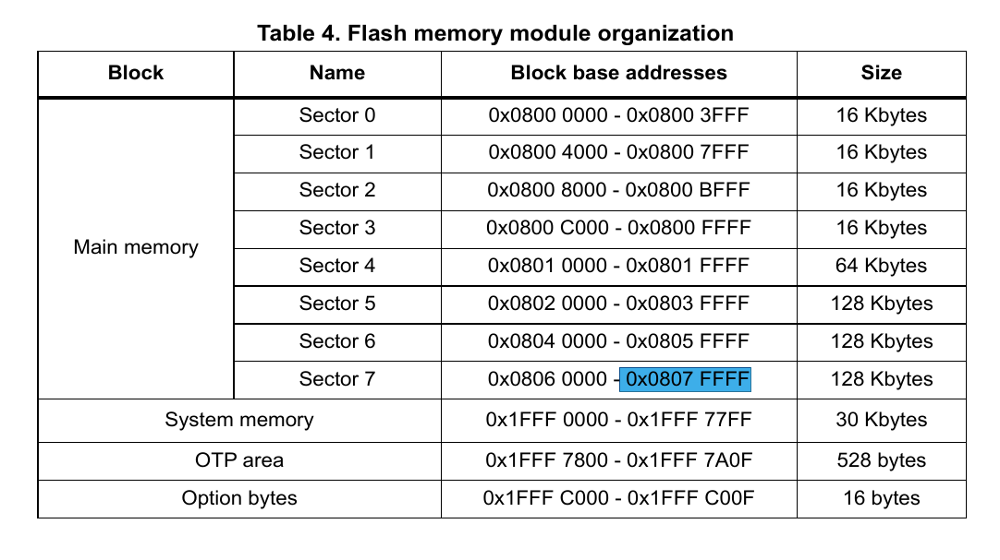
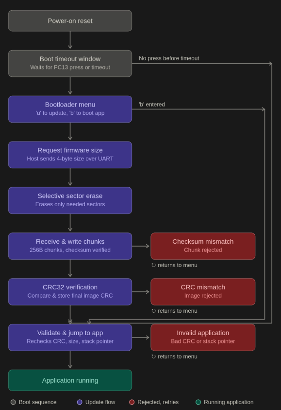
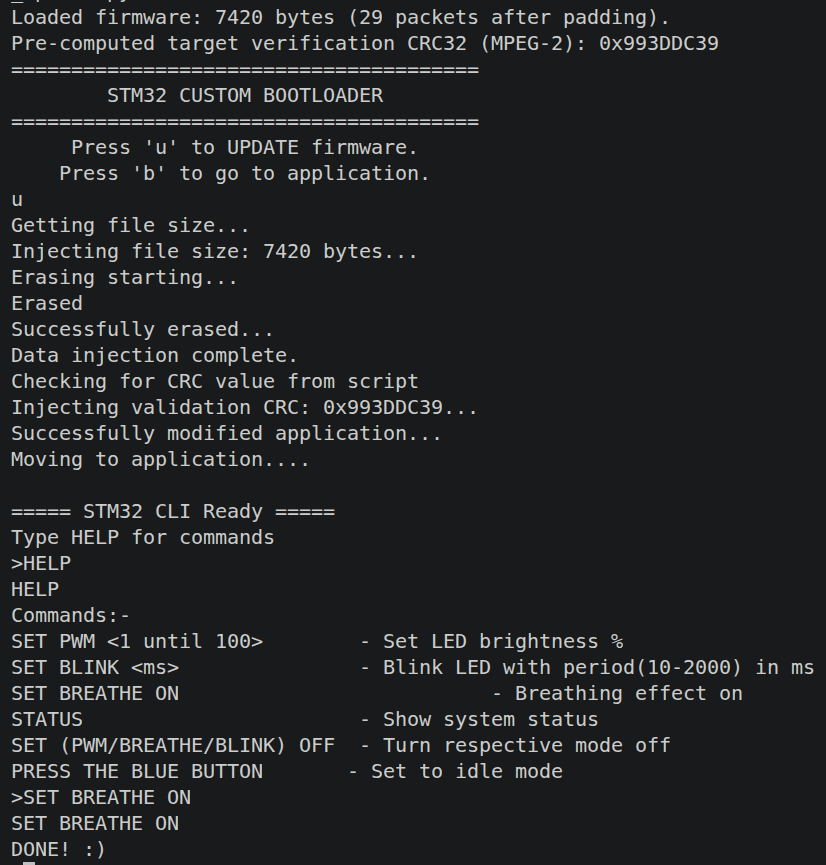
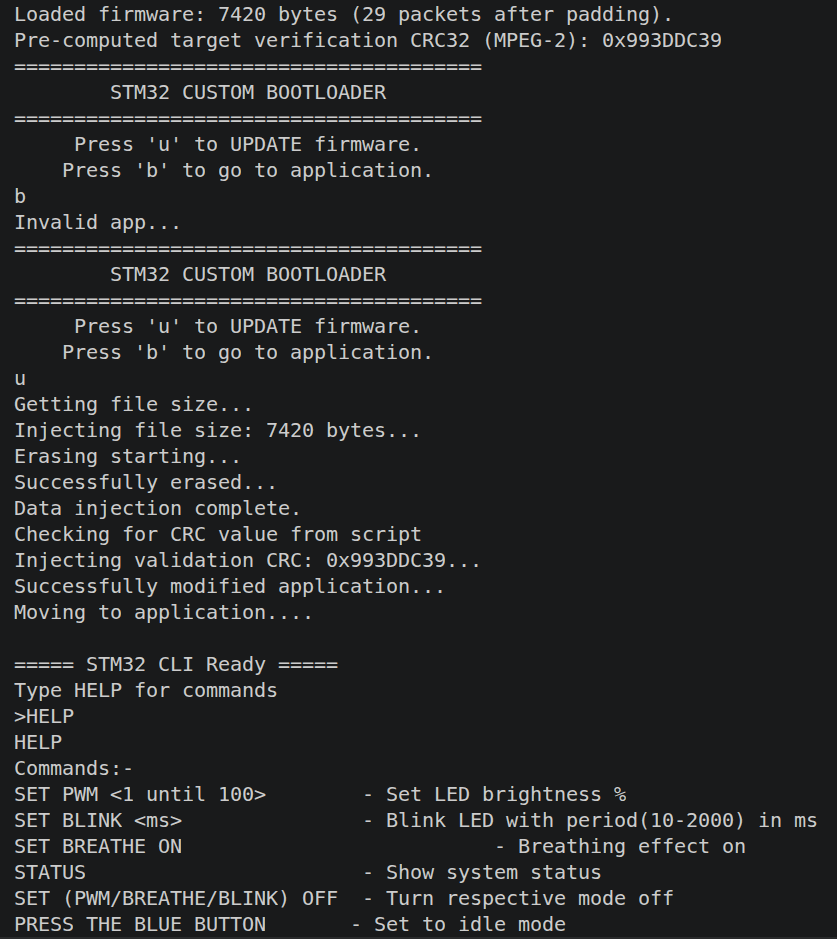

# STM32 Custom UART Bootloader with In-Application Programming (IAP)

A bare-metal bootloader for the STM32F446RE (Cortex-M4, no HAL/CubeMX) that supports
field firmware updates over UART without an external programmer/debugger, with
CRC32-based image integrity verification checked on every boot.

## Overview

Flash is partitioned into two independent images:

| Region     | Address        | Role                                                      |
|------------|----------------|------------------------------------------------------------|
| Bootloader | `0x08000000`   | Entry point on every reset. Owns update logic, flash programming, boot-time validation, and handoff to the application. |
| Application| `0x08008000`   | The actual firmware. Runs only after the bootloader validates its integrity and jumps to it. |
| Metadata   | fixed footer near top of flash | Stores the application's end address and CRC32, written once per successful update, read on every boot. |

On every reset, the bootloader runs first. It waits in a timeout window for a
button press (PC13) to enter an interactive menu over UART; if no button press
occurs before the timeout, or the menu is exited, it validates and jumps into
the application automatically.

*Sector layout: bootloader region, application region, and where the CRC/end-address metadata lives relative to the sectors that get erased on update.*

## Features

- Bare-metal, register-level implementation — no HAL, no CubeMX-generated init code
- Interactive UART menu (update firmware / boot to application)
- Host sends the firmware's size up front; bootloader computes exactly how many
  flash sectors need erasing and skips the rest, reducing wear versus a
  fixed-range erase
- Chunked firmware transfer (256-byte packets) with per-packet XOR checksum,
  verified before each chunk is written to flash
- Full-image CRC32 verification: computed during the write, confirmed against
  the host's independently-computed value before committing it to flash, and
  **re-verified against flash contents on every subsequent boot** before the
  bootloader will jump to the application — not just once, right after an update
- Boot-time stack pointer sanity check as a second, independent guard before jumping
- Correct ARM Cortex-M reset handoff: IRQ disable, `VTOR` relocation, `DSB`/`ISB`
  barriers, manual `MSP` set, and a raw `BX` into the application's reset handler
- Python host-side tool (`pyserial`) that drives the whole exchange automatically —
  computes the CRC locally, sends size, streams the binary, injects the
  verification CRC — reacting to the bootloader's own status messages rather
  than a fixed timing script

## Firmware Update Protocol

1. Host sends `u` to enter update mode.
2. Bootloader requests the firmware size (4 bytes) from the host.
3. Bootloader computes how many sectors the incoming image will occupy and
   erases only that range.
4. Bootloader receives firmware in fixed 256-byte chunks, each followed by a
   1-byte XOR checksum; mismatches abort the update and return to the menu.
5. Each chunk is written to flash and simultaneously fed into the hardware
   CRC peripheral.
6. After the last chunk, the host sends its independently-computed CRC32 of
   the full (padded) image; the bootloader compares it against its own
   running CRC. On match, both the CRC and the application's end address are
   written to a fixed metadata location in flash.
7. Bootloader re-validates the freshly written image (CRC walk over the
   application region, using the just-stored end address) and jumps.
8. **On every future boot**, before jumping, the bootloader reads the stored
   end address and CRC from the metadata footer, recomputes the CRC over that
   exact flash range, and refuses to jump if it doesn't match — this is what
   catches corruption from causes other than a failed transfer (partial
   writes from a prior power loss, unrelated flash faults, etc.).
   
## Selective Sector Erase

STM32F446's flash sectors are non-uniform in size (16KB / 16KB / 16KB / 16KB /
64KB / 128KB / 128KB / 128KB across sectors 0–7 — see RM0390 Table 5). A naive
implementation erases a fixed sector range on every update regardless of the
actual image size, which wastes erase cycles on sectors the new firmware
doesn't even touch.

Instead, the bootloader holds a small lookup table of each sector's end
address. Once it knows the incoming firmware size (sent by the host before any
data transfer begins), it computes the application's end address and walks
the sector table starting from the first application sector, erasing one
sector at a time and stopping as soon as a sector's end address covers the
computed end address — rather than always erasing out to the last sector.
This keeps erase-cycle wear proportional to the actual firmware size instead
of the maximum possible application size.
<figure>
  
  <figcaption><i>Full state diagram: boot decision, update menu, transfer/verify, and both failure paths (bad checksum, bad CRC/stack pointer).</i></figcaption>
</figure>

<figure>
  
  <figcaption><i>A complete update: menu → `u` → erase → transfer → CRC match → jump to application.</i></figcaption>
</figure>

<figure>
  
  <figcaption><i>A deliberately corrupted transfer being caught and rejected instead of bricking the board.</i></figcaption>
</figure>

## Tools & Environment

- **Language:** C (firmware), Python 3 + `pyserial` (host tool)
- **Toolchain:** `arm-none-eabi-gcc`, `gdb-multiarch`, `openocd`, `make`
- **Hardware:** STM32 Nucleo-F446RE
- **Reference docs:** RM0390 (STM32F446 reference manual), PM0214 (Cortex-M4
  programming manual)

## Building & Flashing
Build both images with their respective linker scripts (bootloader at 0x08000000,
application at 0x08008000), flash the bootloader via ST-Link/OpenOCD, then run the
host tool to push application updates over UART.

python3 firmware_update.py

## Known Limitations

Documented gaps, left intentionally out of scope for this project:

- **Single-slot update:** the application region is erased before the new
  image is written. A power loss mid-update currently leaves no valid
  application to boot into — the boot-time CRC check will correctly detect
  and refuse to run a corrupted image, but there is no fallback image to run
  instead. A dual-bank (A/B) scheme would fix this at the cost of double the
  flash budget and update-slot bookkeeping.
- **No soft-triggered bootloader entry yet:** entry is via a physical button
  press only; there is no mechanism yet for the running application to
  request a reboot into update mode (e.g. via a backup-register magic value).

## Future Work

- Backup-register magic-value trigger for software-initiated update requests
  from the running application.
- Dual-bank update slots for power-loss safety.
